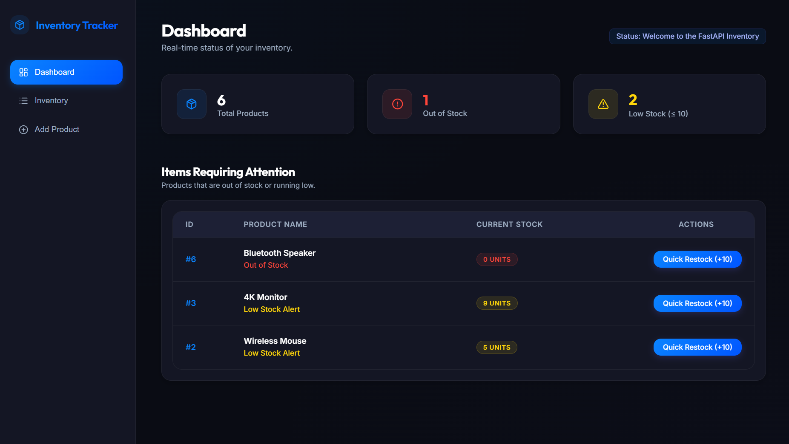
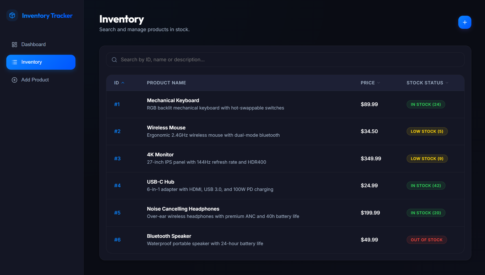
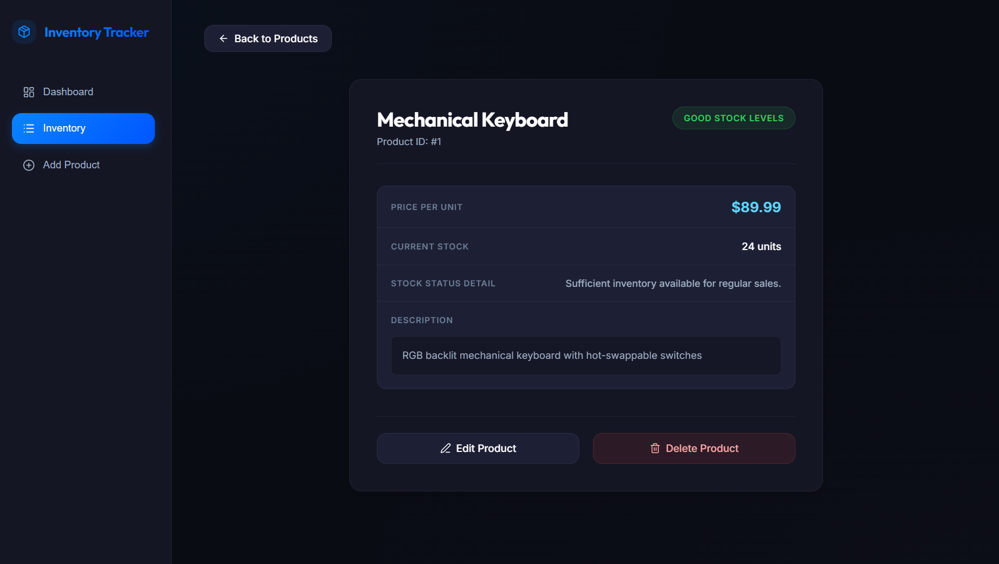
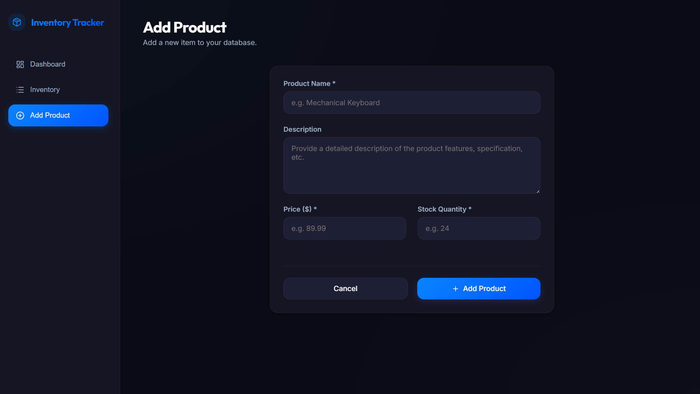

#  FastAPI Inventory

FastAPI Inventory is a full-stack inventory management app featuring a FastAPI backend and a React frontend. It provides product CRUD operations, stock management, and automatic database seeding.

---

## ✨ Features

*   **Product CRUD**: Create, view, update, and delete products.
*   **Stock Management**: Restock products by updating quantity via a custom API endpoint.
*   **Database Seeding**: Automatically creates database tables and seeds demo products on startup.
*   **Interactive UI**: Glassmorphic dashboard featuring a responsive layout and smooth transitions.
*   **Auto-Generated Docs**: Self-documenting API using Swagger UI.

---

## 📸 Preview

| | |
| :---: | :---: |
| **Home Page** | **All Products** |
|  |  |
| **Product Details** | **Add Product** |
|  |  |

---

## 🛠️ Tech Stack

*   **Backend**: Python, FastAPI, SQLAlchemy ORM, Pydantic v2, PostgreSQL (psycopg2), Uvicorn
*   **Frontend**: React (Vite), Vanilla CSS (Glassmorphism layout), React Icons
*   **AI Tools**: Antigravity

---

## 📁 Structure

*   `backend/` – FastAPI REST API, SQLAlchemy models, and schemas
*   `frontend/` – React frontend dashboard SPA
*   `.venv/` – Local Python virtual environment

---

## 🚀 Setup

### Prerequisites
*   **Python 3.10+**
*   **Node.js 18+**
*   **PostgreSQL** (running locally)

### Database Setup
1. Create a database named `inventory_db` in PostgreSQL:
   ```sql
   CREATE DATABASE inventory_db;
   ```
2. Create a `.env` file in the `backend/` directory from `.env.example`:
   ```bash
   cp .env.example .env
   ```
3. Update the `DATABASE_URL` in `.env` with your database credentials.

### Backend
```bash
cd backend

# Windows (PowerShell)
..\.venv\Scripts\Activate.ps1

# Windows (CMD)
..\.venv\Scripts\activate.bat

# macOS/Linux
source ../.venv/bin/activate

# Install dependencies
pip install fastapi uvicorn sqlalchemy psycopg2 pydantic python-dotenv

# Run backend
uvicorn main:app --reload
```
*   **API Docs (Swagger UI)**: `http://localhost:8000/docs`
*   *Note: Seeds demo products on startup if the database is empty.*

### Frontend
```bash
cd frontend
npm install && npm run dev
```
*   **App**: `http://localhost:5173`

---

## 🔌 API

*   `GET /` – Connectivity check
*   `GET /products` – Get all products
*   `GET /products/{id}` – Get product details
*   `POST /products` – Create product
*   `PUT /products/{id}` – Update product
*   `DELETE /products/{id}` – Delete product
*   `POST /products/{id}/restock` – Restock product quantity (accepts `amount` query parameter)

---

## 🏛️ Architecture

*   **Design**: Clean layered-style architecture (`Routing -> Schemas -> DB Models -> CRUD`).
*   **Data Flow**: Pydantic schemas validate requests before SQLAlchemy models execute DB operations.
*   **Database**: Automatic session management, database transaction safety, and automatic seeding.

---

> **Note**: The frontend of this project was built using AI tools.
